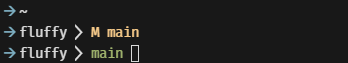
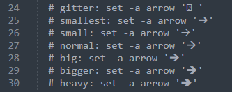

### Fluffy
<div>
  
</div>

A fluffy-ish like theme for [Oh My Fish][omf-link] based on [nai](https://github.com/oh-my-fish/theme-nai).

[](/LICENSE)
[](https://fishshell.com)
[](https://www.github.com/oh-my-fish/oh-my-fish)

<br/>

#### Features

- Truncated CWD (just the current folder name)
- Git branch, dirty state (M) and head detach (HD)

####  Basic Customization
```
🡪 cd ~/.local/share/omf/themes/fluffy/functions
🡪 nano fish_prompt.fish
```
You will see different arrow that you can uncomment:
<div>
  
</div>

<br/>

> Warning: If you will choose to do not have any arrow
> then you will need to comment line 58.

##### License

[MIT][mit] © [katekyy][author] et [al][contributors]


[mit]:            https://opensource.org/licenses/MIT
[author]:         https://github.com/{{USER}}
[contributors]:   https://github.com/{{USER}}/theme-fluffy/graphs/contributors
[omf-link]:       https://www.github.com/oh-my-fish/oh-my-fish

[license-badge]:  https://img.shields.io/badge/license-MIT-007EC7.svg?style=flat-square
