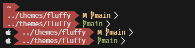
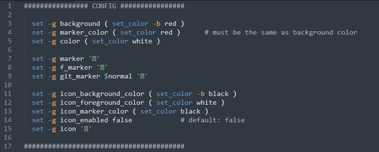

### Fluffy
<div>
  
</div>

A fluffy-ish like theme for [Oh My Fish][omf-link] based on [nai](https://github.com/oh-my-fish/theme-nai).

[](/LICENSE)
[](https://fishshell.com)
[](https://www.github.com/oh-my-fish/oh-my-fish)

<br/>

> **Warning**:
> You need to have Nerd Fonts in order to get this theme to work.

#### Features

- Truncated CWD (just the current and previous directory name)
- Git branch, dirty state (M) and head detach (HD)
- Icons

####  Basic Customization
```bash
~> cd ~/.local/share/omf/themes/fluffy/functions
~> nano fish_prompt.fish
```
You will see different settings that you can set:
<div>
  
</div>

<br/>

